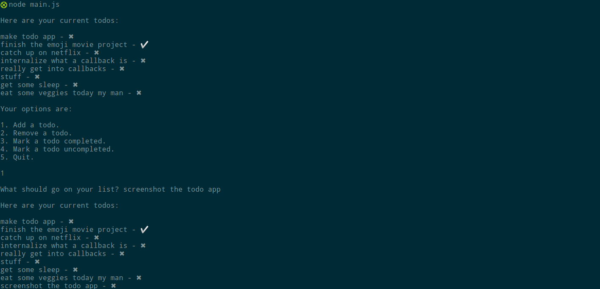
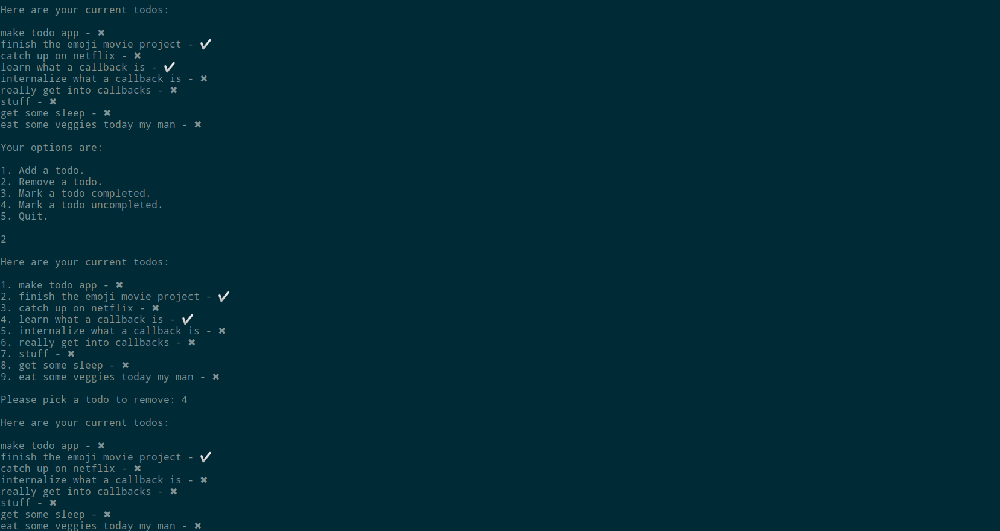
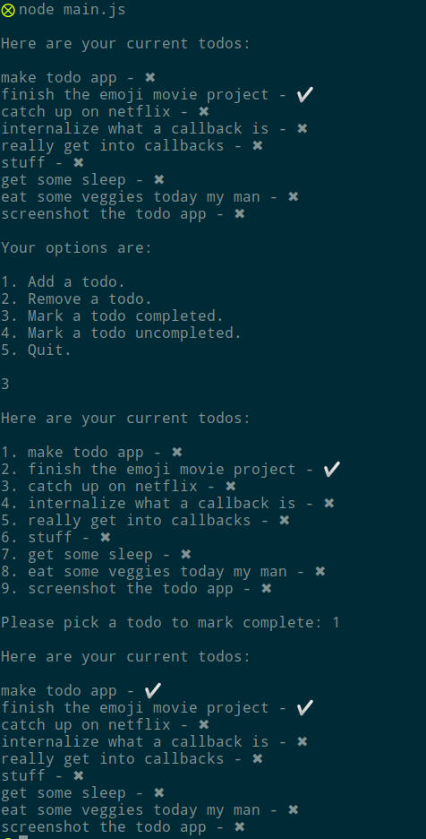
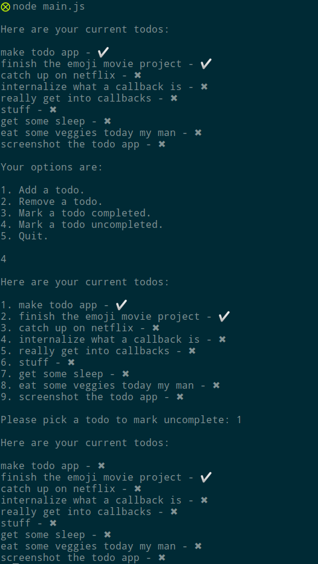

# Todo - Node Version

### How Our Interface Looks

Adding a todo:



Removing a todo:



Marking a todo complete:



Marking a todo uncomplete:



Quitting:


### Workflow

Create a `main.js` file and work ENTIRELY in there. As your code changes the CSV file, feel free to change it back manually with VS Code. Making a backup copy (or just re-downloading it from GitHub) may be a good idea.


### Steps

##### Familiarize Yourself With the CSV File

There's no header with this CSV simply for ease of coding a solution (having to skip the first row is an annoyance we don't need right now), but the file would probably have one in the real world. So not having a header, let's check out its general shape, which is nice and simple. Each row has two values: the text of our todo, and its "completeness", represented by the string `complete` or the string `uncomplete`. That's it. Let's get to `main.js` and our code!


##### Loading and Displaying Our Todos

* The first thing we'll need is the `fs` module. `require` it in.
* Now we'll need an array to hold our todos in once we've loaded them from the CSV file. Note that we're putting this in the global space, which is fine for a small app but would turn into quite a headache in a larger one. Fortunately, you'll be learning better "state management" later on!
* Let's load the todos in from our CSV. Create a function, maybe called `loadTodos`. Let's start out by using the `fs` method `readFileSync`, passing it the path to our `csv` file and the obligatory string `utf8`. Save the return value, a big ol' newline- and comma-separated string into a variable. Feel free to log it to see what you've got!
* Now split it on the newlines to get yourself an array of comma-separated row strings.
* Loop through those strings, splitting each on the comma. You'll note that there are two values in the resulting little array: the text and the completeness. Feel free to log the sub-array to see what you've got!
* Now push that little array into our todos array.
* We can check if this works simply by calling the function below its definition and then console.logging our todos array. Run `node main.js` and see what you get! (You should get a multi-dimensional array with little todo item sub-arrays that perfectly mirror the CSV file. That's what you should get.)
* But, of course, we don't want to just log an array for our users, so let's write another function, maybe imaginatively called `displayTodos`. It should loop through each todo in our list and log it out to the terminal. Building a nicely-formatted string would be nice here; maybe a ` - ` string in between the todo and its completeness, and an emoji to represent that completeness? Here are two you can use: ✅ and ✖. YOU'RE WELCOME.
* Okay, now let's check these functions out. Call `loadTodos` and then `displayTodos`, then run the whole thing with `node main.js`. You should get a nice little list!


##### Reading the User's Input Asynchronously With Callbacks Like the Glorious Champions of the Code Wars That We Are

* To read the user's input in a multi-step process, we're going to have to use the built-in `node` module `readline`. `require` it in, and then we will have to use this crazy line of code to configure things properly:

```javascript
const interface = readline.createInterface({input: process.stdin, output: process.stdout})
```

What we're telling it is to use `stdin` and `stdout` to interact with the user, which stand for "standard in" and "standard out" and are, well... standard. This `interface` thing we get back is going to have some really cool methods for making a more complete interface happen. Let's use it!

* Down at the very bottom of our file, after we load and display our todos, we're going to use our fancy `interface` object's `question` method by calling `interface.question`. The `question` method takes two parameters: a string to print out as the question we'll ask them, and a function for `node` to call once the user enters their answer. This function, which we'll make, is a "callback" function; `node`will call it for us when the time is right. This way, we don't try to speed ahead of the user with our fast-running code, as synchronous code does. `node` will wait for the user, and when the user hits enter, it will call our function for us. Thanks, `node`!

So: let's pass the following string as our "question", though of course you're welcome to change it up as much as you want.

```javascript
const menu = `
Your options are:

1. Add a todo.
2. Remove a todo.
3. Mark a todo completed.
4. Mark a todo uncompleted.
5. Quit.

`
```

This uses a neat feature of backtick strings, which is that carriage returns are actual carriage returns. No need for a `\n` here!

Pass the `menu` variable that holds that string into `interface.question`, and then we'll also pass a variable called `handleMenu` (or... something better) in as well. What will `handleMenu` be? The function that `node` will call for us. Pass that variable in now, and next we'll create it!

* Now it's next and we're creating it. `handleMenu` is a function that will take in one parameter, which you can call whatever you want. What will be in it will be whatever the user typed as a response to our menu above, passed in to us by `node`. (Thanks again, `node`! You rock!) For now, let's check if it's `1` and console.log our parameter if we are. **But don't run your code yet!** It will hang, as we're not telling `node` yet to stop listening for user's input. We will soon.
* Please also note that your parameter to this function comes in as a string (all our user's input will!), so compare it to the **string** `1`, or change it to a number explicitly or implicitly, or however you want to do it.*
* If they don't type in a `1`, we'll quit. Make it an `else` (or a `default` case for a `switch` statement), and that way we'll quit no matter what they'll do. In that `else`, just console.log a message telling the user that they're quitting.
* Okay, let's tell `node` not to listen to the user once they've done their task. We can do that simply by using our  `interface` object's `close` method. Call it at the end of this function and let's check it out. Run your app, answer `1` to the prompt, and see if you get that `1` logged back at you. Then type in anything else and see if you get your message that we're quitting.
* Next: let's ask a followup question.


##### Following Up

* We have a callback that runs when node gets the user's input on what menu option to take, but we need to be able to follow up and say, okay, what todo do you want to add/remove/mark? We're getting far beyond taking in arguments through `process.argv` now!
* What we can do is make another function, call it `add`, that will add the todo that the user types in. When the user has typed in `1`, right there in the `if` logic, run the `question` method again. This time, we'll ask our followup question, and once they've answered it, `node` will call our (so far hypothetical) `add` function. Pass in a string asking the user what to put on their todo list as the first parameter, and then pass our `add` function as the second.
* Okay, let's make our `add` function. Once the user types their todo in, `node` will pass that string to this function. This function will be pretty simple so far: add that todo text as the first element of a new array, with `uncomplete` as the second. Then push that array into our todos array, and run `displayTodos`. 
**NOTE: we failed to say in the original version of this README that we now need to move the `interface.close()` call down to the bottom of this function. The key is that we close the input/output UI process only once we're entirely done taking input from the user, and we're only absolutely done with that in our callback functions.**
* Run your app, answer the followup question, and see if it prints it!
* But check your `csv`. The new todo didn't get in there! We only changed our array, and when we hit the bottom of our code and exit our app, that array is gone. Next: saving it.


##### Saving Our Data

After each time our user changes their data, we'll need to not just update our array, but write that array's new contents to our file. It will, in many ways, be the reverse of reading a CSV, which we've done here and also before. Let's go backwards!

* Let's make a new function, maybe... `saveTodos`?
* We'll have to do a basic mapping operation, where we'll make a new array of comma-separated strings instead of sub-arrays. So instead of each todo being `['take out the trash', 'uncomplete']`, it will be 'take out the trash,uncomplete'. Make a new empty array.
* Now let's loop through our todos array, and for each todo, push into our new array a string in the format above. Then we'll have an array of CSV rows.
* Now! If we `join` the elements of that array of CSV rows, we'll be right back to a big long CSV string. Feel free to console.log your results and see!
* Now we can call another great `fs` method, `writeFileSync`. It assumes `utf8`, so we don't have to pass that, but we DO have to pass two arguments: the path to the file we're writing to, and the new contents. (Which will replace the old; changing the file without fully rewriting it is beyond the scope of this particular project!) Pass in the file path and the CSV string and you're done!
* Now let's go back and make sure this works. In `add`, AFTER you've changed `todos`, call `saveTodos`. It will look at the contents of your todos array and write to the file based on that.


##### The Rest

That's most of the work if you have the preceding functions. To get the ability to remove and mark complete/uncomplete, you'll have to add some more callback functions as well as modify what we have here and there. But those remaining features follow the same structure as `add`, with variations big and small. Let's take a peek.

* Removing todos - We'll have to figure out how to remove from our todos array (I suggest `splice`!), then we can save the data to our CSV and display it for our users. We'll also have to change our todo display a bit so the user can type in which todo to remove. Maybe we can add numbers to our todos when displaying them? If so, don't forget to adjust both for indices being 0-based and for their number to come in as a string.
* Marking our todos complete and uncomplete will have many of the same challenges as removing--asking for the todo the user wants and then finding it--but will be doing something very different to our todos array by changing the second value of the sub-array from `complete` to `uncomplete` (or vice versa).


##### Stretch Goals

Coming soon!
